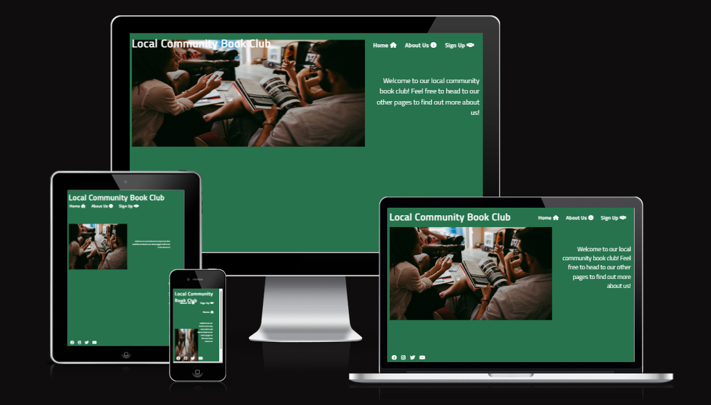
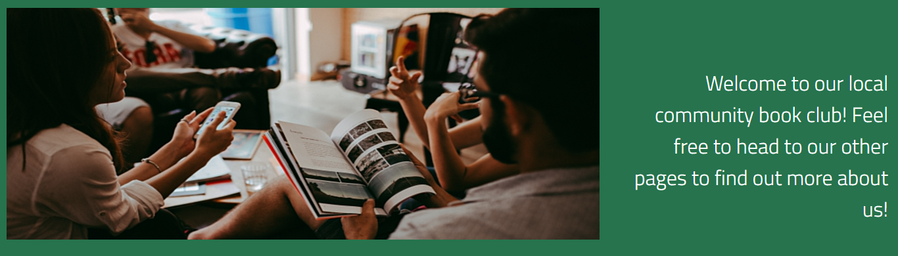
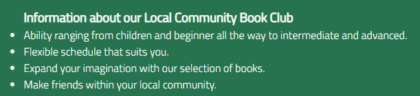
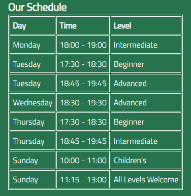
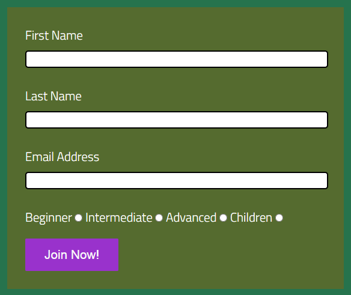
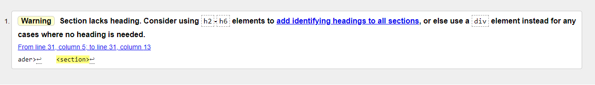

# Local Community Book Club
My Local Community Book Club site is aimed at people who love reading and also people who want to start reading more. It offers reading groups for readers of all abilities and children, so whatever level you are there is something for you. Being focused on local community, it aims to bring local people together and share their love of reading.

## Features

### Existing Features

#### Navigation Bar
* The navigation bar is used throughout the site on all 3 pages, providing the user with an easy to use navigation bar which allows for page to page scrolling without using the back button. The navigation bar links to the Logo, Homepage, About Us and Join Us sections of the site.

#### Homepage
* My homepage includes a image which catches the attention of the user showing a group of people enjoying themselves reading with good company, which sets the users expectations from the very start.
* The homepage also includes a short paragraph which summarises the main aim of the site, which is to be a local book club for a community.

#### Footer
* My footer is shown in the bottom left hand corner of my site, and appears on every page of the site. 
* My footer displays links to our social media platforms, which are Facebook, Instagram, Twitter and YouTube. These links open into a new tab to allow for a better user experience.
* The footer is an important feature of my site as it connects the user to us directly.

#### Image 
* This image displays a bookshelf which shows the wide range and variety of books they could read within the book club.
* I added an image of a colourful bookshelf to excite the user about the endless possibilities of reading books. 

#### Infomation List
* List displaying the information surrounding the local community book club. 
* An important selection of information that the user requires to gain a better understanding of the site, and what its purpose is.

#### Schedule Table
* A table to show the user the weekly timetable for the range of classes that the local community book club offers. 
* The table shows the time slots of the classes, what level the class is and also what day of the week the class they are looking for is.

#### Join Us Form
* A form which enables the user to join the local community book club, being able to specify which level class you wish to join. The user is required to enter their first name, surname and email address.

### Features Left to Implement
* If I had more time and more experience I would like to add a further Homepage besides from index.html, which would give the site more depth and would create a better user experience.
add Gallery page, showcasing images from the local community book club. Within this Gallery page, I would also love to include a video trailer for the clases.
* Another feature I would add is Reading List page that included a link to a shopping list, allowing the users to see what books we read within out book club.

## Testing
* All links within the page working as intended. This includes the main title taking the user to index.html. Also the navigation bar taking the user to index.html, aboutus.html and joinus.html. Finally the footer which sucessfully takes the user to the social network sites Facebook, Instagram, Twitter and YouTube in a seperate tab.
* Testing on various browsers works as intented. The browsers I tested on are Google Chrome, Microsoft EDGE, Mozilla Firefox, and Safari.
* Testing on different screen sizes seemed to work as intended, but I was left extremely dissapointed that my site was left with a few overflowing elements on mobile devices and large screens. Time constraints dictated that I could not address these issues but for future projects I will purchase a large screen monitor which would be integral in the development phase of the site and allow for further testing. Having tested mobile devices using dev tools which seemed to be okay, once I came to test on a real mobile device the styles I implemented did not come out as I planned. Overall I was left dissapointed with the outcome but it has made me more aware of what is required for a completely successful website.
### Validator Testing
* When passing through the official W3C validator, no errors were returned within HTML but a warning message was recieved as I did not include a header on line 32 within index.html. I was not aware that this is best working practise and due to time constraints I couldnt go back and amend it, this would be something I would address in future projects.

* When passing through the official W3C validator, no errors were returned within CSS.

### Unfixed Bugs
* Time constraits restricted me for developing my site further, so if I was to attempt this project again I would allow myself much more time to spend making things much cleaner for the user.
* The footer caused a lot of issues throughout my project as I did not realise I had put the element outside of the body element and it took me a while to realise I had done so. This is due to my lack of experience but something that was corrected.

## Deployment
* This project was deployed to GitHub while being developed within GitPod. The steps to deploy are as follows:
    * Within the GitHub repository, select Settings.
    * Once in the Settings, select the Pages tab.
    * Under source, select the branch called none and change this selection to main.
    * The page should automatically refresh and the website link is then available.

The link is available here - https://gbartlewski.github.io/portfolio-project1/

## Credits
#### Code
* CodeInstitute Full Stack Developer Course
* YouTube channel Traversy Media
#### Content
* Icons used within the navigation bar were taken from https://fontawesome.com
#### Media
* All images were taken from https://www.pexels.com/